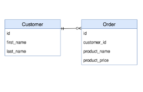
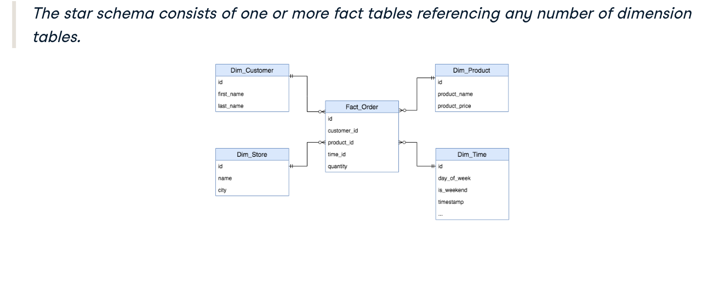
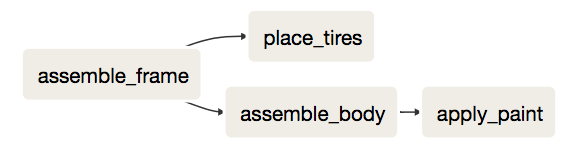

### Create `Customer` table.
***
```sql
CREATE TABLE 'Customer' (
    'id' SERIAL NOT NULL,
    'first_name' varchar,
    'last_name' varchar,
    PRIMARY KEY ('id')
    );
```

### Create `Order` table.
***

```sql
CREATE TABLE 'Order' (
    'id' SERIAL NOT NULL,
    'customer_id' integer REFERENCES 'Customer',
    'product_name' varchar,
    'product_price' integer,
    PRIMARY KEY ('id')
    );
```
### The above schema is represented in the diagram below.



### Join both tables on foreign key.
***

```sql
SELECT * FROM 'Customer' 
INNER JOIN 'Order' 
ON 'customer_id' = 'customer'.'id'
```


# Star schema.
#### This schema consists of one or more fact tables referencing any number of dimension tables.



#### This schema contains:
- Facts. Things that happened, e.g, Product orders.
- Dimensions. Information on the world, e.g, Customer information.
***
```python
data = pd.read_sql("""
SELECT first_name, last_name FROM "Customer"
ORDER BY last_name, first_name
""", db_engine)

# Show the first 3 rows of the DataFrame
print(data.head(3))

# Show the info of the DataFrame
print(data.info())
```


## Joining data on relations.
***

#### Complete the `SELECT` statement, so it joins the `Customer` with the `Order` table.

```python
data = pd.read_sql("""
SELECT * FROM "Customer"
INNER JOIN "Order"
ON "Order"."customer_id"="Customer"."id"
""", db_engine)

# Show the id column of data
print(data.id)
```


***
#### At a low level, we can use `multiprocessing.Pool` API to distribute work on the same machine.

```python
from multiprocessing import Pool

def take_mean_age(year_and_group):
    year, group = year_and_group
    return pd.DataFrame({'Age': group['Age'].mean()}, index = [year])

with Pool(4) as p:
    results = p.map(take_mean_age, athlete_events.groupby('Year'))
    
result_df = pd.concat(results)
    
```

#### Packages such as `dask` offer a layer of abstraction in order to avoid low-level code. 
***

```python

import dask.dataframe as dd

#Partition dataframe into 4.
athlete_events_dask = dd.from_pandas(athlete_events, npartitions = 4)

#Run parallel computations on each partition.
# Because dask uses lazy evaluation, we need to add .compute() to the end of the chain.
result_df = athlete_events_dask.groupby('Year').Age.mean().compute()

```
***

### From task to subtasks.
***
#### For this exercise, you will be using parallel computing to apply the function take_mean_age() that calculates the average athlete's age in a given year in the Olympics events dataset. 

```python 
# Function to apply a function over multiple cores
@print_timing
def parallel_apply(apply_func, groups, nb_cores):
    with Pool(nb_cores) as p:
        results = p.map(apply_func, groups)
    return pd.concat(results)

# Parallel apply using 1 core
parallel_apply(take_mean_age, athlete_events.groupby('Year'), nb_cores = 1)

# Parallel apply using 2 cores
parallel_apply(take_mean_age, athlete_events.groupby('Year'), nb_cores = 2)

# Parallel apply using 4 cores
parallel_apply(take_mean_age, athlete_events.groupby('Year'), nb_cores = 4)

```

### A more convenient way to parallelize an apply over several groups is using the dask framework and its abstraction of the pandas DataFrame.
***

```python
import dask.dataframe as dd

# Set the number of partitions
athlete_events_dask = dd.from_pandas(athlete_events, npartitions = 4)

# Calculate the mean Age per Year
print(athlete_events_dask.groupby('Year').Age.mean().compute())
```


### Parallel computation frameworks.
***
#### PySpark example.
```python
#Load the dataset into athlete_events_spark first.

(athlete_events_spark.groupby('Year')
 .mean('Age')
 .show())

```
#### The above code snippet is the same as the following SQL statement below.

```sql
SELECT year, AVG(age)
FROM views.athlete_events
GROUP BY year
```

```python
# Print the type of athlete_events_spark
print(type(athlete_events_spark))

# Print the schema of athlete_events_spark
print(athlete_events_spark.printSchema())

# Group by the Year, and find the mean Age
print(athlete_events_spark.groupBy('Year').mean('Age'))

# Group by the Year, and find the mean Age
print(athlete_events_spark.groupBy('Year').mean('Age').show())
```


### Running PySpark files.
***
#### `spark-submit` is a tool can help you submit your application to a spark cluster.

```bash
spark-submit \
  --master local[4] \
  /home/repl/spark-script.py
```


## The tools for the job.
***

```python
#Create a DAG object.
dag = DAG(dag_id = 'example_dag', ..., schedule_interval = '0 * * * *')

#Define operations.
start_cluster = StartClusterOperator(task_id = 'start_cluster', dag = dag)
ingest_customer_data = SparkJobOperator(task_id = 'ingest_customer_data', dag = dag)
ingest_product_data = SparkJobOperator(task_id = 'ingest_product_data', dag = dag)
enrich_customer_data = PythonOperator(task_id = 'enrich_customer_data', ..., dag = dag)


#Set up the dependency flow.
start_cluster.set_downstream(ingest_customer_data)
ingest_customer_data.set_downstream(enrich_customer_data)
ingest_product_data.set_downstream(enrich_customer_data)
```

***
#### First, the DAG needs to run on every hour at minute `0`. Fill in the `schedule_interval` keyword argument using the `crontab notation`. For example, every hour at minute N would be `N * * * *`. Remember, you need to run at minute 0.
***
```python
# Create the DAG object
dag = DAG(dag_id="car_factory_simulation",
          default_args={"owner": "airflow","start_date": airflow.utils.dates.days_ago(2)},
          schedule_interval="0 * * * *")
```


***
#### The downstream flow should match what you can see in the image above. The first step has already been filled in for you.

```python
# Create the DAG object
dag = DAG(dag_id="car_factory_simulation",
          default_args={"owner": "airflow","start_date": airflow.utils.dates.days_ago(2)},
          schedule_interval="0 * * * *")

# Task definitions
assemble_frame = BashOperator(task_id="assemble_frame", bash_command='echo "Assembling frame"', dag=dag)
place_tires = BashOperator(task_id="place_tires", bash_command='echo "Placing tires"', dag=dag)
assemble_body = BashOperator(task_id="assemble_body", bash_command='echo "Assembling body"', dag=dag)
apply_paint = BashOperator(task_id="apply_paint", bash_command='echo "Applying paint"', dag=dag)

# Complete the downstream flow
assemble_frame.set_downstream(place_tires)
assemble_frame.set_downstream(assemble_body)
assemble_body.set_downstream(apply_paint)
```